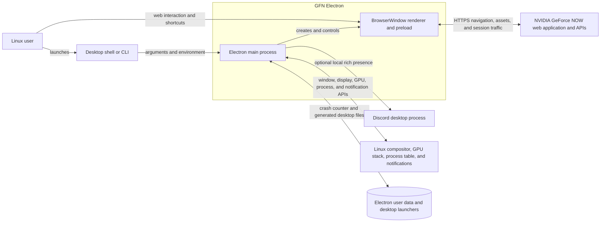
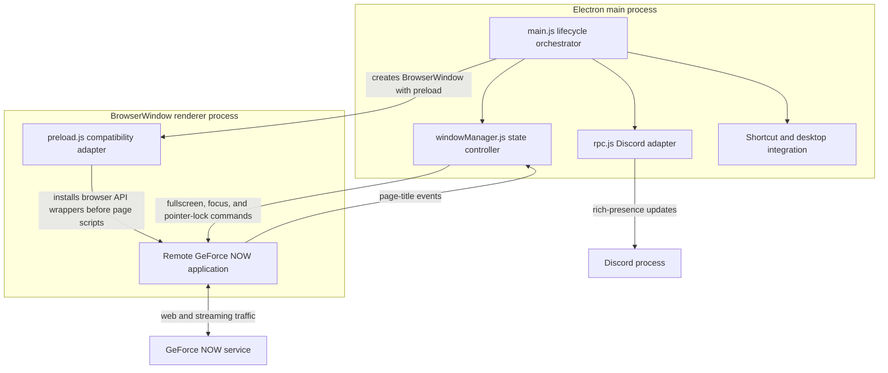
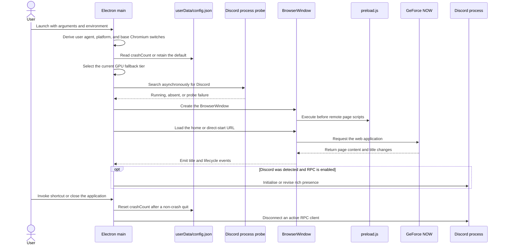
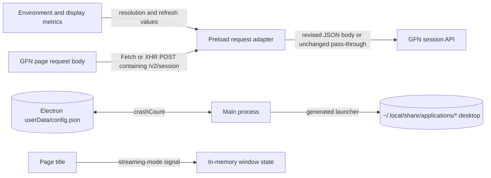
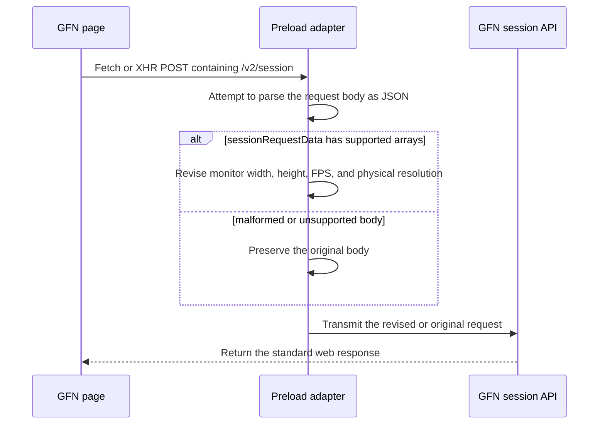
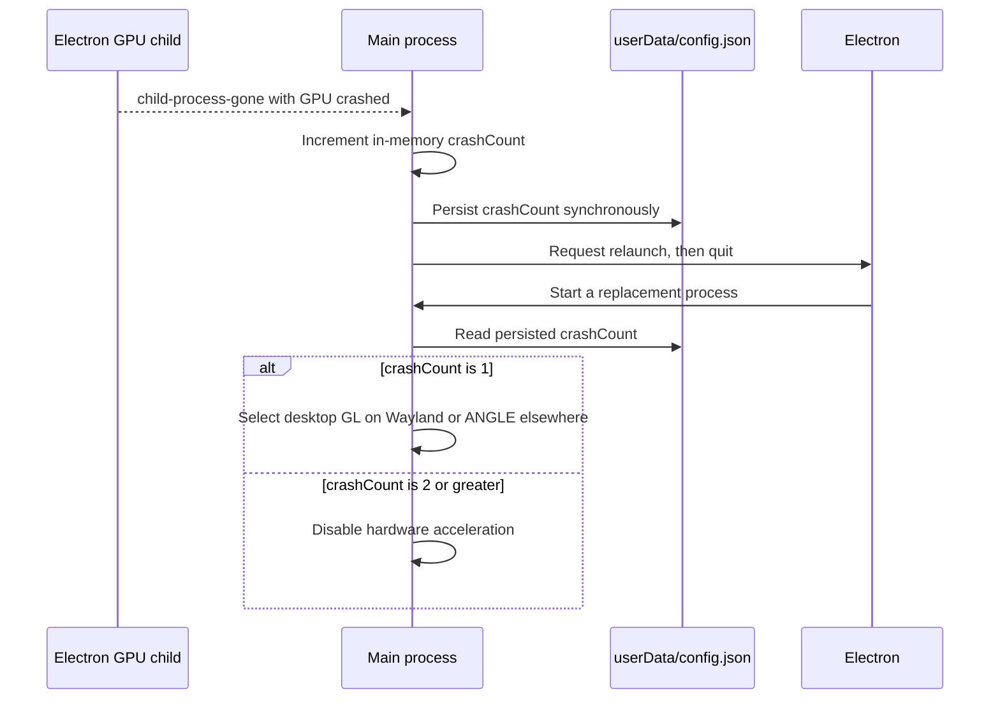
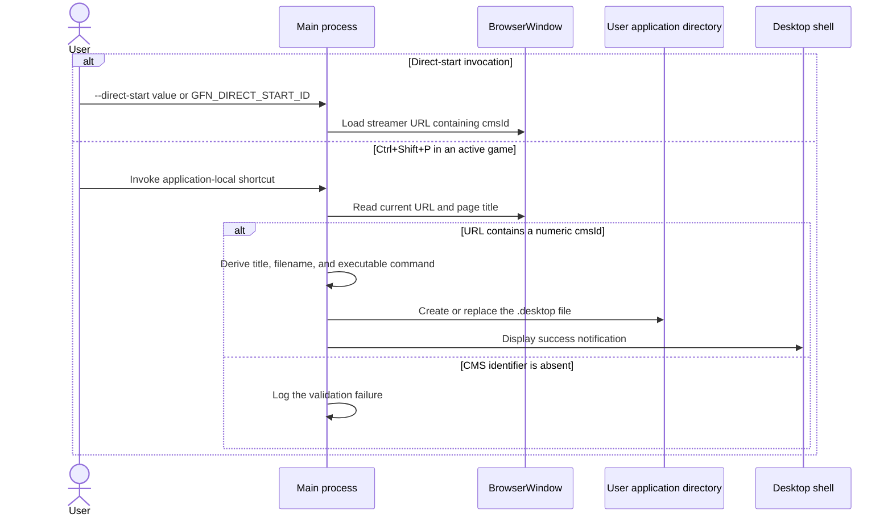
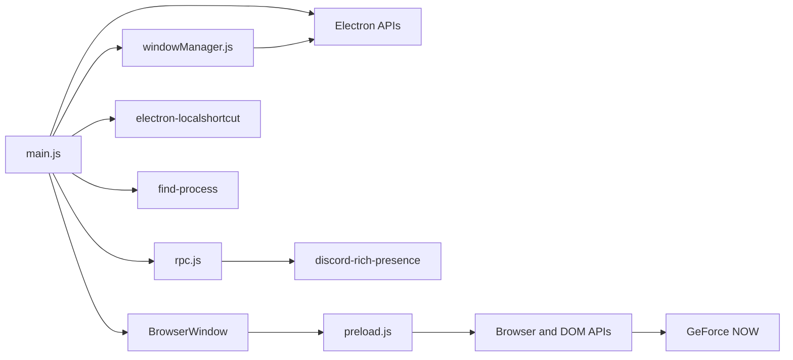

# GFN Electron Architecture

This document records the verified current architecture of GFN Electron. It covers the Electron application, its repository-owned integration code, runtime state, and packaging boundaries; it excludes NVIDIA GeForce NOW internals and distribution infrastructure maintained in other repositories.

## 📑 Table of Contents

- [Table of Contents](#-table-of-contents)
- [Purpose](#-purpose)
- [System Context](#-system-context)
- [Architectural Style](#-architectural-style)
- [Runtime Flow](#-runtime-flow)
- [Components](#-components)
- [Data Architecture](#-data-architecture)
- [Interfaces and Integrations](#-interfaces-and-integrations)
- [Key Flows](#-key-flows)
  - [Session Request Adaptation](#session-request-adaptation)
  - [GPU Crash Recovery](#gpu-crash-recovery)
  - [Direct Launch and Desktop Shortcut Creation](#direct-launch-and-desktop-shortcut-creation)
- [Rendering and Fullscreen Policy](#-rendering-and-fullscreen-policy)
  - [Display Backend Selection](#display-backend-selection)
  - [Streaming Mode State Machine](#streaming-mode-state-machine)
- [Cross-Cutting Concerns](#-cross-cutting-concerns)
  - [Security and Privacy](#security-and-privacy)
  - [Error Handling](#error-handling)
  - [Observability](#observability)
  - [Configuration](#configuration)
  - [Concurrency and Resource Use](#concurrency-and-resource-use)
- [Dependency Direction and Rules](#-dependency-direction-and-rules)
- [External Dependencies](#-external-dependencies)
- [Deployment and Operations](#-deployment-and-operations)
- [Compatibility Contracts](#-compatibility-contracts)
- [Testing and Verification](#-testing-and-verification)
- [Design Constraints](#-design-constraints)
- [Architecture Decisions](#-architecture-decisions)
- [Source Map](#-source-map)
- [Related Documentation](#-related-documentation)

## 🎯 Purpose

GFN Electron is an unofficial Linux desktop client that hosts the official GeForce NOW web application in an Electron `BrowserWindow`. The repository supplies native window lifecycle, Linux display and graphics configuration, stream-request adaptation, desktop shortcuts, GPU crash recovery, and optional Discord rich presence; NVIDIA owns authentication, game discovery, streaming, and the remote user interface.

This document is intended for contributors who modify lifecycle order, renderer compatibility, platform integration, or packaging. It records ownership and change-sensitive contracts so that modifications can be evaluated without treating the remote web application or Electron defaults as repository-owned functionality.

## 🌐 System Context

The Linux user initiates and controls one local Electron application. The application loads remote executable content and data from GeForce NOW, integrates with local operating-system facilities, optionally publishes activity to a local Discord process, and writes limited state beneath user-owned directories. The remote service, local processes, operating system, and user filesystem are all external to the repository-owned system boundary.



The principal external boundaries are:
- **Linux user and launch environment:** Supply command-line arguments, environment variables, keyboard input, and interaction with the hosted web interface. These inputs are local but are not uniformly validated by the application.
- **NVIDIA GeForce NOW:** Supplies the web application, account and session workflows, game-streaming APIs, media, and upstream response semantics over HTTPS. GFN Electron does not own or version these contracts.
- **Discord desktop process:** Optionally accepts rich-presence updates over the local protocol implemented by `discord-rich-presence`. Discord is probed only during application initialisation.
- **Linux platform:** Supplies display-server selection, graphics and video-decoding facilities, process discovery, fullscreen and pointer-lock conduct, and desktop notifications.
- **User filesystem:** Electron resolves the application data directory used for `config.json`; the desktop integration also writes launchers under `~/.local/share/applications`.

## 🏗️ Architectural Style

The implementation is a single-window, process-centred desktop shell with event-driven orchestration. The main process is the composition root. It creates the browser container and directly composes two focused CommonJS modules: a fullscreen state controller and an optional Discord adapter. A preload compatibility adapter executes in the renderer before the remote page and modifies selected browser APIs rather than communicating through a repository-defined IPC protocol.

This is not a local presentation architecture: the remote GeForce NOW page owns the interface and principal domain workflow. Repository code is consequently coupled to browser events, page-title conventions, and selected upstream request shapes.



The principal architecture boundaries are:
- **Main-process orchestration:** [scripts/main.js](scripts/main.js) owns Electron readiness, Chromium switches, window creation, navigation, application-local shortcuts, persistence, relaunch, and shutdown.
- **Renderer compatibility:** [scripts/preload.js](scripts/preload.js) owns browser fingerprint adaptation and mutation of selected GeForce NOW session requests. It has no internal-module dependencies.
- **Window state:** [scripts/windowManager.js](scripts/windowManager.js) owns in-memory streaming and fullscreen state, and converts title and fullscreen events into native window actions.
- **Optional integration:** [scripts/rpc.js](scripts/rpc.js) owns the singleton Discord client and presence lifecycle; failure must not prevent the principal streaming workflow.
- **Remote presentation and domain:** The GeForce NOW page owns interface state, authentication, game selection, and streaming. No repository-owned renderer interface is currently loaded from [scripts/renderer.js](scripts/renderer.js), which is empty.

## 🔄 Runtime Flow



The principal runtime sequence is:
1. Module initialisation derives the Edge-compatible user agent, detects Wayland and Steam Deck indicators, and appends platform and video switches before Electron becomes ready.
2. The main process reads `config.json` from Electron's `userData` directory. A missing or unreadable file retains `{ "crashCount": 0 }`; the value selects a graphics fallback tier.
3. On `app.whenReady()`, the default session receives a client-hint header hook and `find-process` probes for a process named `Discord` before window creation.
4. The main process creates one `BrowserWindow`, attaches [scripts/preload.js](scripts/preload.js), and navigates either to the fixed home page or a URL derived from a direct-start CMS identifier.
5. Preload installs Fetch and XMLHttpRequest wrappers before the remote page uses them. The hosted GeForce NOW page then owns the interactive workflow.
6. Browser-window and page-title events drive fullscreen state, pointer lock, and optional rich-presence updates; registered keyboard shortcuts drive navigation, fullscreen, developer tools, launcher creation, and termination.
7. A normal quit resets the crash counter, disconnects Discord, and unregisters shortcuts. A GPU crash instead persists the incremented counter and relaunches the application at the subsequent fallback tier.

## 🧩 Components

| Component | Responsibility | Principal Dependencies | Lifetime or Ownership |
|-----------|----------------|------------------------|-----------------------|
| [scripts/main.js](scripts/main.js) | Compose the application, configure Chromium, create the window, own shortcuts and filesystem effects, and supervise GPU failure and shutdown | Electron, Node.js filesystem/path/OS APIs, `electron-localshortcut`, `find-process`, window manager, Discord adapter | One module instance for the Electron main-process lifetime |
| `BrowserWindow` and hosted page | Provide the Chromium renderer and execute the remote GeForce NOW interface | Electron renderer, GeForce NOW over HTTPS, preload-installed browser wrappers | One active window is presumed; recreated on `activate` only when none exist |
| [scripts/preload.js](scripts/preload.js) | Suppress selected Electron fingerprints and revise monitor data in supported session requests | Browser Fetch, XMLHttpRequest, DOM, screen, and Electron preload `process` globals | Executed for each navigation in the window's renderer context |
| [scripts/windowManager.js](scripts/windowManager.js) | Maintain fullscreen and game-streaming state and coordinate focus and pointer lock | Electron `app` and `BrowserWindow`; page-title and fullscreen events | Singleton CommonJS module in the main process |
| [scripts/rpc.js](scripts/rpc.js) | Lazily initialise, revise, disconnect, and clear the Discord rich-presence client | `discord-rich-presence`, process arguments, and environment | Optional singleton client from first presence update until shutdown |
| Generated desktop launcher | Persist a direct-start command for the active game in the user's application menu | Current page URL and title, `FLATPAK_ID`, executable path, filesystem, and notifications | One user-owned `.desktop` file per sanitised game-title filename |

## 💾 Data Architecture

GFN Electron has no repository-owned domain database. Its durable state is limited to the GPU crash counter and desktop launchers. Electron's default browser session manages remote web state under framework defaults; repository code modifies request headers and selected request bodies but does not define cookie, cache, or credential retention policy.

The preload adapter transforms session-request JSON in memory. It derives width and height from explicit environment variables or physical display pixels, derives the refresh rate from an environment variable or `60`, and revises matching monitor and physical-resolution records. The transformed body is transmitted to GeForce NOW and is not retained by repository code.



| Data or Store | Owner | Representation and Storage | Lifecycle or Consistency |
|---------------|-------|----------------------------|--------------------------|
| GPU crash state | [scripts/main.js](scripts/main.js) | JSON object containing `crashCount` at `path.join(app.getPath('userData'), 'config.json')` | Read synchronously during module initialisation, incremented before GPU-crash relaunch, and reset on a non-crash `will-quit`; malformed or unreadable content falls back to the in-memory default |
| Stream session request | [scripts/preload.js](scripts/preload.js) | Transient JSON request body containing `sessionRequestData` | Revised immediately before supported Fetch or XMLHttpRequest transmission; malformed and unsupported bodies pass through unchanged; never persisted by repository code |
| Window state | [scripts/windowManager.js](scripts/windowManager.js) | Module-scoped booleans `isFullScreen` and `isGameStreamingScreen` | Process-local and event-driven; reconciled with `BrowserWindow.isFullScreen()` when a transition is requested |
| Desktop launcher | [scripts/main.js](scripts/main.js) | Freedesktop `.desktop` text beneath `~/.local/share/applications` with mode `0644` | Created or replaced synchronously on `Ctrl+Shift+P`; no deletion or stale-launcher maintenance exists |
| Browser session state | Electron default session and remote page | Chromium-managed cookies, cache, storage, and request headers | Lifetime and persistence follow Electron's default session because no custom partition or retention policy is configured |

## 🔌 Interfaces and Integrations

| Interface or Integration | Direction | Contract | Owner | Failure Semantics |
|--------------------------|-----------|----------|-------|-------------------|
| Application invocation | Inbound | `npm start`, packaged executable, `--direct-start <cmsId>`, `--disable-rpc`, and documented environment variables | [scripts/main.js](scripts/main.js), [scripts/preload.js](scripts/preload.js), and [scripts/rpc.js](scripts/rpc.js) | A direct-start flag without an argument logs an error and loads the home page unless the environment supplies an identifier; most other values use permissive parsing or exact string checks |
| GeForce NOW web application | Bidirectional | HTTPS navigation rooted at `https://play.geforcenow.com` and browser-managed subresources and APIs | `BrowserWindow` and remote page | Network, authentication, and service failures remain Chromium or upstream page results; there is no repository retry or error translation |
| Session request adaptation | Outbound | Fetch or XMLHttpRequest `POST` whose URL contains `/v2/session`, with selected `sessionRequestData` arrays | [scripts/preload.js](scripts/preload.js) | JSON parse or shape mismatch returns the original body; the repository does not retry the request |
| Discord rich presence | Outbound | Local Discord RPC using the embedded application identifier and page-title-derived `details` | [scripts/rpc.js](scripts/rpc.js) | Missing Discord, probe failure, explicit disablement, update failure, and disconnect failure all degrade without terminating streaming |
| Linux desktop and display facilities | Bidirectional | Electron window APIs, Wayland/X11 environment detection, process lookup, pointer lock, and notifications | [scripts/main.js](scripts/main.js) and [scripts/windowManager.js](scripts/windowManager.js) | Missing process integration degrades; window and `executeJavaScript` promise failures have no central translation or retry policy |
| Desktop launcher production | Outbound | Freedesktop Desktop Entry text with an executable or Flatpak direct-start command | [scripts/main.js](scripts/main.js) | Missing CMS identifier logs and produces no file; filesystem failure logs and suppresses the success notification |

## 🔀 Key Flows

### Session Request Adaptation



The adapter is installed before remote page scripts execute and captures the original Fetch and XMLHttpRequest functions. Fetch adaptation requires the method and body to be present in the `init` object; XMLHttpRequest adaptation requires a string body. Consequently, semantically equivalent requests that use other body representations or a preconfigured Fetch `Request` may pass without mutation. Parse failures are intentionally transparent and preserve upstream conduct.

### GPU Crash Recovery



Only a child-process event with `type === 'GPU'` and `reason === 'crashed'` activates recovery. The relaunching process preserves the incremented counter because `isQuittingDueToGpuCrash` prevents normal shutdown from resetting it. A subsequent non-crash quit resets the counter to zero, so the next independent launch retries the preferred EGL tier. If persistence fails, relaunch still proceeds, but the subsequent process may repeat an earlier tier.

### Direct Launch and Desktop Shortcut Creation



Direct-start invocation gives a command-line value precedence over `GFN_DIRECT_START_ID` and concatenates the selected value into the streamer URL. Launcher creation is stricter: it extracts only digits from the active URL's `cmsId` query parameter, removes the standard title suffix, sanitises the filename, and selects either a Flatpak command or the current executable. The desktop file's display title and keyword value remain derived from the page title without Desktop Entry escaping.

## ⚙️ Rendering and Fullscreen Policy

### Display Backend Selection

Rendering policy is established before the application becomes ready and therefore cannot be revised during a process lifetime. `WAYLAND_DISPLAY` selects the native Wayland path; any other environment selects the non-Wayland path.

| Environment | Preferred Tier, `crashCount = 0` | First Fallback, `crashCount = 1` | Subsequent Fallback, `crashCount >= 2` |
|-------------|-----------------------------------|------------------------------------|-----------------------------------------|
| Wayland | Ozone Wayland with EGL; Vulkan-related Chromium capabilities deactivated | Desktop OpenGL | Electron hardware acceleration deactivated |
| Non-Wayland | EGL | ANGLE | Electron hardware acceleration deactivated |

Both paths activate VA-API and accelerated video capabilities and ignore Chromium's GPU blocklist. The explicit `enable-accelerated-video-decode` switch is appended only while `crashCount <= 1`. Aggressive native GPU buffers, rasterisation, zero-copy, and GPU-memory-buffer video frames remain opt-in through `GFN_ENABLE_EXPERIMENTAL_GPU_FLAGS=1` because source comments record missing text and texture defects on some Linux driver stacks.

### Streaming Mode State Machine

The window manager treats a page title containing `on GeForce NOW` as the streaming-mode signal. Entering streaming mode forces fullscreen, requests pointer lock through renderer JavaScript, and focuses the window. A title that omits the phrase exits streaming mode and permits fullscreen exit.

`F11` and `Super+F` request a manual state inversion. While streaming mode is active, the controller rejects a transition out of fullscreen, and a native `leave-full-screen` event requests fullscreen again. Outside streaming mode, manual entry and exit are permitted. On Steam Deck, `SteamDeck=1` creates the window in fullscreen and synchronises the controller's initial state; Wayland input-method flags support compositor-mediated text input.

## 🧵 Cross-Cutting Concerns

### Security and Privacy

The renderer loads remote executable content. `BrowserWindow` explicitly configures `contextIsolation: false`, so preload and page scripts share a JavaScript context rather than an isolated bridge. The window does not explicitly configure `nodeIntegration` or `sandbox`; their effective values consequently follow the installed Electron release defaults. No repository-defined IPC channel exposes main-process operations to the page, but the shared context permits page code to interfere with preload-installed globals and request wrappers.

New-window requests are denied as separate windows but are navigated in the existing `BrowserWindow` without a repository-maintained origin allow-list. The preload therefore remains a compatibility boundary whose conduct may apply after navigation beyond the expected origin.

The application does not implement local authentication or read GeForce NOW credentials. Authentication data and web storage remain under the remote page and Electron default-session boundary. Discord integration transmits a page-title-derived activity string to the local Discord client when enabled. Startup logs include the complete process argument list, which can expose launch identifiers in console output. No application-specific telemetry, metrics exporter, or remote logging client exists in repository code.

Input validation is limited. Direct-start values are concatenated without URI encoding or format validation, and remote page titles are inserted into Desktop Entry fields without escaping, although launcher filenames and shortcut-derived CMS identifiers are sanitised. These are current verification and hardening gaps, not guarantees supplied by the architecture.

### Error Handling

Error ownership remains local to each integration:
- Configuration read failures log and retain the default crash state; write failures log without preventing quit or relaunch.
- Discord process-probe failures resolve as "not running"; update failures log; disconnect failures are suppressed.
- Session-body parse failures return the original body so the upstream request can continue.
- Desktop-launcher filesystem failures log and omit the success notification.
- GPU process crashes activate persisted relaunch and progressive graphics degradation.

There is no central exception boundary, user-facing error model, retry scheduler, or failure correlation identifier. Several asynchronous Electron operations, including URL loading and renderer JavaScript execution, are invoked without awaiting or translating rejected promises.

### Observability

The main process emits unstructured console records for the user agent, arguments, fullscreen and streaming transitions, Discord probe and update failures, configuration failures, shortcut creation, and GPU relaunch. Successful launcher creation also emits a desktop notification. The preload intentionally suppresses JSON adaptation failures and has no diagnostic signal.

The repository contains no metrics, traces, structured log schema, health check, audit stream, or log-retention policy. Diagnosis therefore depends on terminal output, Electron developer tools, and manual reproduction.

### Configuration

| Configuration Area | Source | Responsibility | Override or Secret Policy |
|--------------------|--------|----------------|---------------------------|
| Display mode | `WAYLAND_DISPLAY`; `SteamDeck=1` | Select native Wayland flags and initial Steam Deck fullscreen conduct | Read once during module initialisation; no runtime revision |
| GPU experimentation and recovery | `GFN_ENABLE_EXPERIMENTAL_GPU_FLAGS=1`; `userData/config.json` | Activate optional aggressive switches and select the persisted crash tier | Explicit environment opt-in affects switches; persisted `crashCount` controls recovery; no secret data |
| Stream monitor report | `GFN_RESOLUTION_WIDTH`, `GFN_RESOLUTION_HEIGHT`, `GFN_REFRESH_RATE` | Override values inserted into supported session requests | Parsed integers take precedence; invalid or zero values use display-derived dimensions or `60`; negative integers are not rejected |
| Direct launch | `--direct-start <cmsId>`; `GFN_DIRECT_START_ID` | Select the initial streamer URL instead of the home page | A present command-line value precedes the environment value; neither source is a secret store |
| Discord | `--disable-rpc`; `GFN_DISABLE_RPC=1` | Prevent rich-presence initialisation and updates | Either disable signal is sufficient; the Discord application identifier is embedded in source |
| Packaged launcher command | `FLATPAK_ID`; `app.getPath('exe')` | Select the executable command written into a generated desktop launcher | A non-empty Flatpak identifier selects `flatpak run`; otherwise the current executable path is quoted |
| Service identity | Constants in [scripts/main.js](scripts/main.js) and [scripts/rpc.js](scripts/rpc.js) | Define the GeForce NOW origin, spoofed browser identity, and Discord application identity | No runtime override; revision requires a source modification |

### Concurrency and Resource Use

Repository-owned JavaScript executes on Electron's main or renderer event loop. Main-process mutable state requires no explicit locking because callbacks execute serially on one JavaScript thread. Electron independently owns renderer, GPU, and utility subprocesses; the main process supervises GPU termination through `child-process-gone`.

Discord detection is asynchronous and awaited before window creation so the global `browser-window-created` listener can conditionally attach title updates. Filesystem reads and writes for the crash counter and desktop launchers are synchronous on the main thread. They are minor in volume but can delay event processing on a slow or unavailable filesystem. There are no queues, worker pools, retry loops, request bounds, or backpressure mechanisms in repository code.

## 🧭 Dependency Direction and Rules

The main process is the only composition root. Internal dependencies point from [scripts/main.js](scripts/main.js) towards focused adapters; those adapters do not import the main module. Preload remains independent from CommonJS application modules and operates through renderer globals. The hosted page communicates with native state only indirectly through Electron browser events and preload-modified browser APIs.



The principal dependency rules are:
- Main-process orchestration may depend on Electron, Node.js facilities, and the window and RPC modules; internal modules must not import the composition root or create a cyclic lifecycle dependency.
- The window manager owns fullscreen state and may use Electron window APIs, but it must not own navigation, persistence, Discord, or packaging concerns.
- The Discord module may depend on its protocol library and process configuration, but failure must remain optional and must not control window creation or streaming.
- Preload must not import main-process adapters. Its compatibility changes are confined to browser-visible APIs and upstream request representations.
- Remote page code must not receive a repository-defined direct native or main-process API. The current architecture defines no IPC bridge.
- [scripts/renderer.js](scripts/renderer.js) is empty and unreferenced; it supplies no current dependency layer or extension contract.

## 📦 External Dependencies

| Dependency | Responsibility | Integration Boundary | Architectural Consequence |
|------------|----------------|----------------------|---------------------------|
| `electron` | Supply the desktop process model, Chromium renderer, browser session, native window APIs, command-line switches, and packaging runtime | Main process, preload, and window manager | Electron defaults and Chromium capability names are compatibility-sensitive; process topology and security defaults change with runtime revisions |
| `electron-builder` | Produce Linux deployment artefacts from [package.json](package.json) | `npm run build` | Packaging configuration is coupled to electron-builder target names, substitutions, and filesystem layout |
| `electron-localshortcut` | Register application-scoped keyboard accelerators | Main process readiness and shutdown | Shortcut lifecycle is process-global and requires explicit `unregisterAll()` during quit |
| `find-process` | Probe the local process table for Discord | Main-process startup | Discord detection depends on the literal process name `Discord` and occurs only once per application launch |
| `discord-rich-presence` | Communicate activity to the local Discord client | [scripts/rpc.js](scripts/rpc.js) | The integration is tied to this library's client and presence shape but remains optional to streaming |
| NVIDIA GeForce NOW | Supply the hosted interface, authentication, APIs, and game stream | Browser navigation and preload-adapted requests | Upstream page titles, URL shapes, request schemas, and browser checks can change independently and invalidate local adaptations |

## 🚀 Deployment and Operations

The deployment unit is a Linux Electron desktop application. [package.json](package.json) configures `electron-builder` with `asar: false`, Linux ZIP and AppImage targets, and the repository desktop file as an extra file. The generated artefact name follows `geforcenow-electron_<version>_linux.<extension>`. The repository README also directs users to FlatHub, AUR, and GitHub Releases, but this repository contains no Flatpak or AUR packaging manifest. The current package configuration omits electron-builder's `desktopName`, so the packager cautions that desktop environments may not associate a running window with the installed Desktop Entry.

At runtime, one Electron main process owns one active `BrowserWindow`; Electron creates renderer, GPU, and utility subprocesses as required. Discord remains an external local process. The application requires a Linux graphical session, compatible graphics stack, writable Electron user-data storage, and network access to GeForce NOW. It is a per-user interactive client and has no horizontal scaling or service-availability model.

| Concern | Current Design | Architectural Consequence |
|---------|----------------|---------------------------|
| Process topology | One main process, one presumed active window, Electron-managed child processes, and optional local Discord IPC | Main-process termination concludes the application; GPU-child failure is recoverable through relaunch |
| Artefacts | Unarchived Linux ZIP and AppImage production plus desktop metadata; electron-builder `desktopName` is not configured | Source files remain separate in packaged output, and window-to-launcher association is not guaranteed by the package configuration |
| Persistent state | Electron default-session data, `userData/config.json`, and optional user desktop launchers | Recovery and web-session state are local to the OS account; there is no migration, synchronisation, or central persistence service |
| Startup and shutdown | Platform switches are appended before readiness; shutdown resets crash state after normal termination, disconnects RPC, and unregisters shortcuts | Lifecycle ordering is part of correctness and changes require full process-level verification |
| Recovery | GPU crashes relaunch at progressively more conservative graphics tiers | Recovery can reduce acceleration and stream performance; persistence failure may prevent tier progression |
| Availability | Interactive rendering depends on the local graphics environment, Chromium compatibility, network access, and upstream GeForce NOW | The client provides no offline mode, local service substitute, or upstream failover |
| Continuous integration | Node.js 20 CI executes `npm ci` and `npm run build --if-present`; CodeQL analyses JavaScript and TypeScript | CI proves dependency installation, packaging, and static analysis only; it does not exercise an interactive Electron session |
| Security maintenance | [SECURITY.md](SECURITY.md) designates only the latest FlatHub release as supported | Operators using GitHub Releases, AUR, other channels, or previous releases are outside the documented maintenance commitment |

## 🛡️ Compatibility Contracts

| Contract | Owner | Invariant | Verification | Change Policy |
|----------|-------|-----------|--------------|---------------|
| Public launch controls | [scripts/main.js](scripts/main.js), [scripts/preload.js](scripts/preload.js), and [scripts/rpc.js](scripts/rpc.js) | Documented argument and environment names, disable semantics, and command-line precedence remain aligned with [README.md](README.md) | Manual launch matrix; no automated contract tests | Preserve recognised names and semantics or document and coordinate an intentional breaking revision |
| Browser identity | [scripts/main.js](scripts/main.js) | Window user agent and `sec-ch-ua`, `sec-ch-ua-mobile`, and `sec-ch-ua-platform` headers describe a consistent Linux Edge/Chromium client using the current Chromium major version | Inspect browser developer tools and request headers manually | Revise user agent and client hints together whenever browser-compatibility policy changes |
| GeForce NOW session adaptation | [scripts/preload.js](scripts/preload.js) | Supported `/v2/session` POST bodies retain valid JSON while monitor and physical-resolution fields receive consistent dimensions | Inspect requests in developer tools and exercise Fetch and XMLHttpRequest paths manually | Treat upstream URL and JSON-shape changes as compatibility migrations; preserve pass-through for unsupported bodies |
| Streaming title convention | [scripts/windowManager.js](scripts/windowManager.js) and [scripts/rpc.js](scripts/rpc.js) | The phrase `on GeForce NOW` identifies active streaming and detailed Discord activity | Navigate between home and a game while observing title, fullscreen, and presence | Coordinate both consumers if the upstream title convention changes |
| GPU crash state | [scripts/main.js](scripts/main.js) | `config.json` remains readable as JSON with a numeric-compatible `crashCount`, and crash relaunch must not reset it before the replacement process reads it | Force or simulate GPU child crashes and inspect tier progression manually | Add validation or migration before changing the persisted shape; malformed state currently falls back to defaults only when parsing fails |
| Generated desktop launcher | [scripts/main.js](scripts/main.js) | A numeric shortcut-derived CMS identifier maps to a direct-start command in a Freedesktop Desktop Entry file | Create a launcher in executable and Flatpak environments, then invoke it manually | Preserve valid Desktop Entry syntax and both launch modes; revise sanitisation and escaping with compatibility checks |

## ✅ Testing and Verification

The repository contains no test files, test runner, `npm test` script, or coverage configuration. The Node.js workflow installs locked dependencies and packages the application on Node.js 20; the CodeQL workflow supplies scheduled and change-driven static analysis. These gates do not verify browser request adaptation, graphics fallback, fullscreen transitions, Discord IPC, navigation, or generated launchers.

Execute the principal automated verification with:

```bash
npm run build
```

Architecture-sensitive modifications additionally require manual verification:
- Launch on Wayland and a non-Wayland session and inspect the selected Chromium graphics path.
- Navigate between the home page and an active game and verify fullscreen, focus, pointer lock, and title-driven transitions.
- Inspect a `/v2/session` request for default and environment-supplied monitor values.
- Exercise direct-start from both the command line and environment, including a missing identifier.
- Exercise Discord present, absent, and explicitly deactivated conditions.
- Create and invoke desktop launchers in executable and Flatpak contexts.
- Exercise GPU crash relaunch across fallback tiers and then confirm reset after a normal quit.

## ⚠️ Design Constraints

- **Upstream web coupling:** The client depends on GeForce NOW URLs, page titles, browser checks, and request schemas that NVIDIA can revise independently. Pass-through limits request-adaptation failure, but title and navigation changes can alter native conduct.
- **Shared preload context:** `contextIsolation: false` permits the remote page and preload to affect the same JavaScript environment. This is a current compatibility and security constraint rather than an isolated renderer bridge.
- **Linux graphics matrix:** Display-server and graphics switches are determined at process start and require relaunch to change. Correctness depends on Electron, Chromium, compositor, VA-API, and driver interactions that packaging alone does not verify.
- **Single-window premise:** Shortcut handlers and the window manager select `BrowserWindow.getAllWindows()[0]`. Secondary windows are denied for `window.open`, and multi-window state is neither modelled nor supported.
- **Heuristic streaming state:** Fullscreen protection and Discord details depend on a literal page-title phrase rather than an explicit upstream event or protocol.
- **Ephemeral recovery policy:** Crash fallback persists across crash-induced relaunches but resets after any normal quit, intentionally retrying the preferred graphics tier on the next independent launch.
- **Main-thread filesystem access:** Configuration and launcher files use synchronous APIs in the main process. The volume is minor, but slow storage can delay interface events.
- **Desktop identity configuration:** The installed Desktop Entry declares `StartupWMClass`, but electron-builder reports that `desktopName` is absent. Association between a running packaged window and its launcher consequently requires platform verification.
- **No extension registry:** Integrations, shortcuts, and configuration are directly composed in the main module. Additional capabilities require source modification rather than registration through a plugin or dependency-injection boundary.
- **No behavioural automation:** Packaging and CodeQL are the only automated gates. Process lifecycle, remote compatibility, and Linux graphics conduct depend on manual verification.

## 📝 Architecture Decisions

| Decision | Rationale | Consequence | Record |
|----------|-----------|-------------|--------|
| Use native Ozone Wayland with EGL and deactivate Vulkan capabilities on Wayland | Source comments identify ANGLE Vulkan as incompatible with `ozone-wayland` and select EGL for native surfaces | Wayland receives a specialised switch set and a distinct fallback tier from non-Wayland sessions | Source comments in [scripts/main.js](scripts/main.js); documented here |
| Maintain aggressive GPU switches as explicit opt-in | Source comments record missing text and textures on specific Linux driver stacks | Default rendering favours stability; users may activate experimental acceleration through one environment variable | Source comments in [scripts/main.js](scripts/main.js); documented here |
| Persist GPU crash count and relaunch through conservative tiers | A replacement process is required to apply different Chromium and Electron acceleration settings | GPU crashes interrupt the session but can recover automatically with reduced acceleration | Implementation in [scripts/main.js](scripts/main.js); documented here |

## 🗺️ Source Map

| Area | Path |
|------|------|
| Runtime manifest, scripts, dependencies, and packaging | [package.json](package.json), [package-lock.json](package-lock.json) |
| Main-process composition and lifecycle | [scripts/main.js](scripts/main.js) |
| Renderer compatibility and session-request adaptation | [scripts/preload.js](scripts/preload.js) |
| Fullscreen and streaming state | [scripts/windowManager.js](scripts/windowManager.js) |
| Discord rich presence | [scripts/rpc.js](scripts/rpc.js) |
| Reserved, currently empty renderer module | [scripts/renderer.js](scripts/renderer.js) |
| Installed desktop metadata | [com.github.hmlendea.geforcenow-electron.desktop](com.github.hmlendea.geforcenow-electron.desktop) |
| Packaging and static-analysis automation | [.github/workflows/node.js.yml](.github/workflows/node.js.yml), [.github/workflows/codeql-analysis.yml](.github/workflows/codeql-analysis.yml) |

## 📚 Related Documentation

Complementary repository documents:
- [README.md](README.md) defines user capabilities, launch controls, installation channels, development commands, and project orientation.
- [SECURITY.md](SECURITY.md) defines supported distributions, vulnerability scope, private reporting, and disclosure policy.