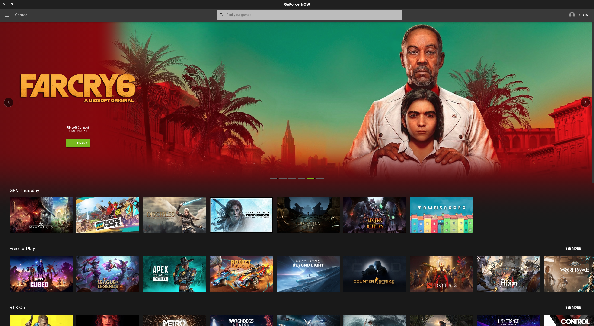

[](https://hmlendea.go.ro/funding)
[](https://github.com/hmlendea/gfn-electron/releases/latest)
[](https://github.com/hmlendea/gfn-electron/actions/workflows/node.js.yml)
[](https://gnu.org/licenses/gpl-3.0)

# GFN Electron

Unofficial client for Nvidia's GeForce NOW game streaming service, providing a native Linux desktop experience with Wayland support, Steam Deck integration, and Discord rich presence.



## Table of Contents

- [Disclaimers](#disclaimers)
  - [Legal](#legal)
  - [Expectations](#expectations)
- [Installation](#installation)
  - [Manual Installation](#manual-installation)
- [Features](#features)
- [Usage](#usage)
  - [Keyboard Shortcuts](#keyboard-shortcuts)
  - [Command-line Arguments & Environment Variables](#command-line-arguments--environment-variables)
- [Development](#development)
  - [Requirements](#requirements)
  - [Clone](#clone)
  - [Build](#build)
- [Update](#update)
- [Contributing](#contributing)
- [Links](#links)
- [License](#license)

## Disclaimers

### Affiliation

This project and its contributors are not affiliated with Nvidia, nor its GeForce NOW product. This repository does not contain any Nvidia / GeForce NOW software. It is simply an Electron wrapper that loads the official GFN web application page, just as it would in a regular web browser.

### Expectations

This is a free and open-source project. Everyone who has contributed to it has done so voluntarily, out of their own free time and goodwill. Contributors are under no obligation to keep working on or maintaining the project, and cannot be expected to do so when life does not afford them that luxury.

If things slow down or go quiet for a while, please be understanding. Documentation may occasionally fall behind, and some issues may linger without an immediate fix — we ask for your patience. If you find the project useful and have some time and development experience, please consider contributing yourself.

## Installation

[](https://aur.archlinux.org/packages/geforcenow-electron/)
[](https://flathub.org/apps/details/io.github.hmlendea.geforcenow-electron)

***Note**: The main version of this project, which receives the most support, is the flatpak version hosted on FlatHub!*

### Manual Installation

 - Go to the [latest release](https://github.com/hmlendea/gfn-electron/releases/latest).
 - Download the specific file that best fits your distro.

***Note**: Manual installations are possible but not supported. Please use the flatpak version if you have any trouble with the manual installation!*

## Features

 - **Native Wayland support** — runs as a native Wayland client when a Wayland compositor is detected, avoiding XWayland overhead and enabling proper compositor overlays
 - **Steam Deck integration** — automatically launches in fullscreen and enables the virtual keyboard overlay when running on Steam Deck
 - **Discord rich presence** — shows what you're playing via Discord RPC (disable with `--disable-rpc` or `GFN_DISABLE_RPC=1`)
 - **Hardware-accelerated video** — enables VA-API, GPU rasterisation, and zero-copy video decode for smooth streaming
 - **Stability fallback** — automatically recovers from GPU crashes by retrying with a different OpenGL backend, falling back to software rendering if needed
 - **Keyboard shortcuts** — fullscreen toggle (`F11` / `Super+F`), home (`Alt+Home`), quit (`Alt+F4`), devtools (`Ctrl+Shift+I`), create desktop shortcut (`Ctrl+Shift+P`)
 - **Direct game launch** — supports `--direct-start <cmsId>` (or `GFN_DIRECT_START_ID=<cmsId>`) to jump straight into a game
 - **Stream quality override** — intercepts session requests to report your true physical resolution and a configurable refresh rate, overcoming the web client's defaults (`GFN_RESOLUTION_WIDTH`, `GFN_RESOLUTION_HEIGHT`, `GFN_REFRESH_RATE`)

## Usage

### Keyboard Shortcuts

| Shortcut | Action |
|---|---|
| `F11` / `Super+F` | Toggle fullscreen |
| `Alt+Home` | Go to home page |
| `Alt+F4` | Quit |
| `Ctrl+Shift+I` | Toggle developer tools |
| `Ctrl+Shift+P` | Create a desktop shortcut for the currently running game |

### Command-line Arguments & Environment Variables

| Argument | Env var | Description |
|---|---|---|
| `--direct-start <cmsId>` | `GFN_DIRECT_START_ID=<cmsId>` | Launch directly into a game by its CMS ID |
| `--disable-rpc` | `GFN_DISABLE_RPC=1` | Disable Discord rich presence |
| — | `GFN_RESOLUTION_WIDTH=<px>` | Override reported stream width in pixels (default: physical screen width) |
| — | `GFN_RESOLUTION_HEIGHT=<px>` | Override reported stream height in pixels (default: physical screen height) |
| — | `GFN_REFRESH_RATE=<hz>` | Override reported refresh rate in Hz (default: 60) |

### More

 - [Basic usage](https://github.com/hmlendea/gfn-electron/wiki/Basic-usage)
   - [Changing the keyboard layout](https://github.com/hmlendea/gfn-electron/wiki/Basic-usage#changing-the-keyboard-layout)
   - [Directly launching a game from the desktop](https://github.com/hmlendea/gfn-electron/wiki/Basic-usage#directly-launching-a-game-from-the-desktop)
 - [Integrations](https://github.com/hmlendea/gfn-electron/wiki/Integrations)
   - [Discord](https://github.com/hmlendea/gfn-electron/wiki/Integrations#discord)
     - [Using native GFN + flatpak Discord](https://github.com/hmlendea/gfn-electron/wiki/Integrations#using-native-gfn--flatpak-discord)
 - [Troubleshooting](https://github.com/hmlendea/gfn-electron/wiki/Troubleshooting)
   - [Gamepad controls are not detected](https://github.com/hmlendea/gfn-electron/wiki/Troubleshooting#gamepad-controls-are-not-detected)
   - [Steam Deck controls are not detected](https://github.com/hmlendea/gfn-electron/wiki/Troubleshooting#steam-deck-controls-are-not-detected)

## Development

### Requirements

You will need [Node.js](https://nodejs.org/) 20 or later and [npm](https://www.npmjs.com/) (bundled with Node.js). On most distributions, installing the `nodejs` and `npm` packages is sufficient.

### Clone

Once you have npm, clone the wrapper to a convenient location:

```bash
git clone https://github.com/hmlendea/gfn-electron.git
```

### Build

```bash
npm install
npm start
```

On subsequent runs, `npm start` will be all that's required.

## Update

Simply pull the latest version of master and install any changed dependencies:

```bash
git checkout master
git pull
npm install
```

## Contributing

Contributions are welcome.

Please:

- keep the pull requests focused and consistent with the existing style
- update the documentation when the behaviour changes

## Links
 - [GeForce NOW](https://nvidia.com/en-eu/geforce-now)
 - [FlatHub release](https://flathub.org/apps/details/io.github.hmlendea.geforcenow-electron)
 - [FlatHub repository](https://github.com/flathub/io.github.hmlendea.geforcenow-electron)
 - [Basic usage](https://github.com/hmlendea/gfn-electron/wiki/Basic-usage)
 - [Troubleshooting](https://github.com/hmlendea/gfn-electron/wiki/Troubleshooting)

## License

Licensed under the GNU General Public License v3.0 or later.
See [LICENSE](./LICENSE) for details.