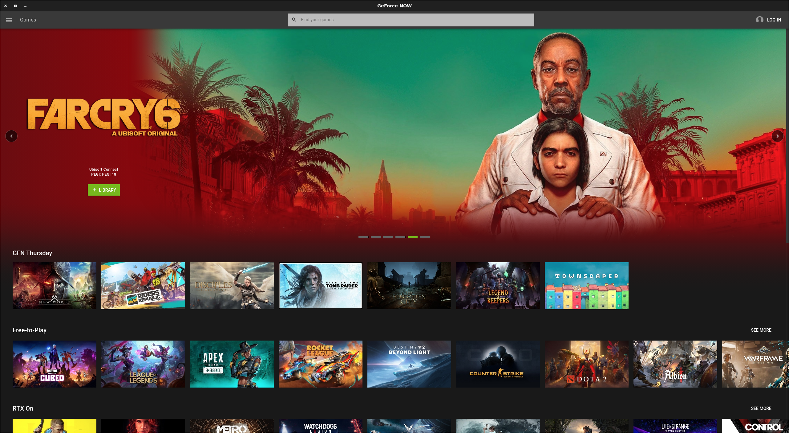

[](https://hmlendea.go.ro/funding)
[](https://github.com/hmlendea/gfn-electron/releases/latest)
[](https://github.com/hmlendea/gfn-electron/actions/workflows/node.js.yml)
[](https://gnu.org/licenses/gpl-3.0)

# GFN Electron

Unofficial desktop client for Nvidia GeForce NOW on Linux, delivering a native Electron-based experience with Wayland support, Steam Deck integration, and optional Discord rich presence.



## 📑 Table of Contents

- [Features](#-features)
- [Disclaimers](#-disclaimers)
  - [Affiliation](#affiliation)
  - [Expectations](#expectations)
- [Usage](#-usage)
  - [Keyboard Shortcuts](#keyboard-shortcuts)
  - [Command-line Arguments and Environment Variables](#command-line-arguments-and-environment-variables)
  - [More Documentation](#more-documentation)
- [Known Limitations](#-known-limitations)
- [System Requirements](#-system-requirements)
- [Installation](#-installation)
  - [CLI Installation](#cli-installation)
- [Development](#-development)
  - [Requirements](#requirements)
  - [Setup](#setup)
  - [Build](#build)
  - [Run](#run)
  - [Dependencies](#dependencies)
- [Project Structure](#-project-structure)
- [Documentation](#-documentation)
- [Contributing](#-contributing)
- [Security](#-security)
- [Helping out](#-helping-out)
- [License](#-license)

## ✨ Features

- Native Wayland support with compositor-aware behaviour
- Steam Deck integration with automatic fullscreen and virtual keyboard overlay
- Discord rich presence integration (optional)
- Hardware-accelerated video pipeline using VA-API and GPU rendering flags
- GPU crash fallback strategy for rendering stability
- Keyboard shortcuts for fullscreen, navigation, and developer tooling
- Direct game launch via CMS identifier
- Stream quality override for resolution and refresh rate reporting

## ⚖️ Disclaimers

### Affiliation

This project and its contributors are not affiliated with Nvidia, nor with the GeForce NOW product. This repository does not include Nvidia or GeForce NOW software. It provides an Electron wrapper that loads the official GeForce NOW web application.

### Expectations

This is a free and open-source project maintained by volunteers. Contributions occur as contributor availability permits.

## 🚀 Usage

Launch the client from a terminal:

```bash
npm start
```

### Keyboard Shortcuts

| Shortcut | Action |
|---|---|
| `F11` / `Super+F` | Toggle fullscreen |
| `Alt+Home` | Navigate to the home page |
| `Alt+F4` | Exit the application |
| `Ctrl+Shift+I` | Toggle developer tools |
| `Ctrl+Shift+P` | Create a desktop shortcut for the active game |

### Command-line Arguments and Environment Variables

| Argument | Environment Variable | Description |
|---|---|---|
| `--direct-start <cmsId>` | `GFN_DIRECT_START_ID=<cmsId>` | Launch directly into a game by CMS identifier |
| `--disable-rpc` | `GFN_DISABLE_RPC=1` | Disable Discord rich presence |
| - | `GFN_ENABLE_EXPERIMENTAL_GPU_FLAGS=1` | Re-enable aggressive GPU flags for experimentation |
| - | `GFN_RESOLUTION_WIDTH=<px>` | Override reported stream width |
| - | `GFN_RESOLUTION_HEIGHT=<px>` | Override reported stream height |
| - | `GFN_REFRESH_RATE=<hz>` | Override reported stream refresh rate |

### More Documentation

- [Basic usage](https://github.com/hmlendea/gfn-electron/wiki/Basic-usage)
- [Integrations](https://github.com/hmlendea/gfn-electron/wiki/Integrations)
- [Troubleshooting](https://github.com/hmlendea/gfn-electron/wiki/Troubleshooting)

## ⚠️ Known Limitations

- Application behaviour depends on the current GeForce NOW web interface and can change when upstream web functionality changes.
- Manual installation packages receive less maintainer support than the Flatpak distribution.

## 🖥️ System Requirements

- **OS:** Linux
- **Runtime:** Node.js 20 or later
- **Graphics:** GPU drivers with WebGL and hardware video decode support are recommended

## 📦 Installation

[](https://flathub.org/apps/details/io.github.hmlendea.geforcenow-electron)
[](https://aur.archlinux.org/packages/geforcenow-electron)
[](https://github.com/hmlendea/gfn-electron/releases)

### CLI Installation

```bash
flatpak install flathub io.github.hmlendea.geforcenow-electron
```

or, for Arch Linux users via AUR:

```bash
paru -S geforcenow-electron
```

or, if you use `yay`:

```bash
yay -S geforcenow-electron
```

## 🛠️ Development

### Requirements

- [Node.js 20+](https://nodejs.org/)
- [npm](https://www.npmjs.com/)

### Setup

```bash
npm install
```

### Build

```bash
npm run build
```

### Run

```bash
npm start
```

### Dependencies

| Package | Purpose |
|---------|---------|
| `discord-rich-presence` | Discord RPC integration |
| `electron-localshortcut` | Application-local keyboard shortcuts |
| `find-process` | Process discovery for integration logic |

## 🗂️ Project Structure

The key directories and files are:

| Path | Purpose |
|------|---------|
| `scripts/main.js` | Electron main-process lifecycle, window initialisation, and runtime flags |
| `scripts/preload.js` | Safe bridge between renderer and Electron APIs |
| `scripts/renderer.js` | Renderer-side interactions and UI behaviour |
| `scripts/rpc.js` | Discord rich presence integration |
| `scripts/windowManager.js` | Window creation and management logic |
| `com.github.hmlendea.geforcenow-electron.desktop` | Desktop entry metadata |

## 📚 Documentation

Full documentation is available in the project Wiki:

- [Basic usage](https://github.com/hmlendea/gfn-electron/wiki/Basic-usage)
- [Integrations](https://github.com/hmlendea/gfn-electron/wiki/Integrations)
- [Troubleshooting](https://github.com/hmlendea/gfn-electron/wiki/Troubleshooting)

## 🤝 Contributing

You are welcome to bring any suggestion, feedback or modification to this project.

When doing so, please:
- Maintain cross-platform compatibility
- Maintain the pull requests as focused and consistent with the existing code style
- Maintain your branch up-to-date with `master`
- Revise the documentation when behaviour changes
- Properly test all changes

## 🔒 Security

For information on reporting security vulnerabilities, see [SECURITY.md](./SECURITY.md).

## 💝 Helping out

Discovered a problem or have a suggestion? [Open an issue](https://github.com/hmlendea/gfn-electron/issues)!

If you find this project useful, consider [funding it](https://hmlendea.go.ro/funding) or starring ⭐️ it on GitHub!

[](https://hmlendea.go.ro/funding)

## 📄 License

This project is being distributed under the `GNU General Public License v3.0` or later.
See [LICENSE](./LICENSE) for details.